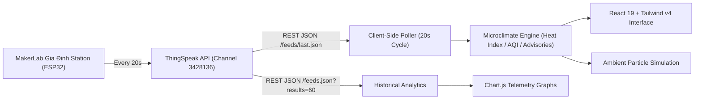

# 🌿 GiaDinh EcoPulse — Urban Microclimate & Health Companion

<div align="center">


**Đồng Hồ Vi Khí Hậu & Sức Khỏe Đô Thị Gia Định, TP. Hồ Chí Minh**  
*Turning raw IoT environmental station telemetry into actionable lifestyle advisories, generative data art, and interactive urban analytics.*

[Explore Features](#-key-features) • [Quick Start](#-quick-start) • [Deployment](#-deployment) • [API & Hardware](#-maker--developer-hub)

</div>

---

## 📖 Overview

**GiaDinh EcoPulse** is an open-source, responsive web application that monitors the real-time urban microclimate in Gia Định (Ho Chi Minh City, Vietnam). 

Powered by the **MakerLab Gia Định Environmental Station** (ThingSpeak Channel `3428136`), the platform continuously consumes 8 live meteorological sensor streams every 20 seconds. Instead of just displaying raw sensor numbers, EcoPulse translates them into **human-centric lifestyle advisories**:
- *"Is it safe to jog outside right now?"*
- *"Will my laundry dry quickly today?"*
- *"Is this sidewalk cafe too noisy or hot for studying?"*
- *"Do I need a respirator mask for the current PM2.5 particulate level?"*

---

## ✨ Key Features

### 1. 🏃 Smart Urban Lifestyle Advisories
Intelligent heuristic scoring matrices evaluating real-time atmospheric conditions:
- **Running & Workout Index**: Computes NOAA Heat Index, relative humidity, and PM2.5 dust concentration.
- **Sidewalk Cafe & Outdoor Work**: Balances street acoustic noise ($dB$), ambient temperature, and airflow.
- **Laundry Drying Speed**: Analyzes solar irradiance ($lux$), humidity percentage, and wind velocity.
- **Commuter Mask Advisory**: Compares PM2.5 against WHO and US EPA 24-hour air safety thresholds (standard mask vs. N95 respirator).

### 2. 📡 8 Live Sensor Telemetry Gauges
- **🌡️ Temperature & Heat Index**: Ambient air $^\circ C$ with perceived "Feels Like" index calculated via the Rothfusz NOAA regression model.
- **💧 Relative Humidity**: $\%RH$ combined with temperature to derive the Magnus-Tetens dew point.
- **🧭 Wind Compass Rose**: Rotating directional compass with exact bearing ($0^\circ-360^\circ$), speed ($m/s$ and $km/h$), and Beaufort wind scale ratings.
- **🌫️ Fine Dust (PM2.5)**: Evaluated against US EPA Air Quality Index (AQI) categories with intuitive color-coded badges.
- **🔊 Ambient Noise Equalizer**: Real-time sound level ($dB$) accompanied by dynamic frequency spectrum visualizers and urban acoustic benchmarks.
- **☀️ Solar Light Intensity**: Translates lux into day/night & solar exposure categories (Night, Dim Indoor, Overcast, Intense Tropical Sun).
- **⏱️ Barometric Pressure**: Real-time atmospheric pressure ($kPa$ and $hPa$).
- **🔥 Heat Exposure Risk**: Physiological heat stress categorization (Normal, Caution, Extreme Caution, Danger).

### 3. 🎨 Interactive Generative Ambient Canvas
A customized HTML5 Canvas simulation that responds directly to live weather:
- **Wind Vectors**: Hundreds of particles flow across the screen at the exact bearing angle and velocity recorded by the station.
- **Air Turbidity**: Particle density and color hue adapt dynamically to PM2.5 dust concentration.
- **Solar Lighting**: Background ambient gradient shifts between nocturnal twilight, soft daylight, and bright tropical sun based on solar lux.

### 4. 📈 24-Hour Trend & Historical Telemetry
- Interactive multi-axis time-series charts powered by Chart.js.
- Tabs for Temperature & Heat Index, PM2.5 Dust, Noise Level, Humidity, and Wind Speed.
- Automatic **Minimum**, **Average**, and **Maximum** statistical calculations over the current time window.

### 5. 🛠️ Maker & Developer Open Data Hub
- One-click copyable ThingSpeak REST API endpoints.
- Ready-to-use code snippets in **cURL**, **JavaScript**, **Python**, and **Arduino / ESP32**.
- **Instant CSV and JSON export** of telemetry records for researchers and students.

### 6. 🌐 Bilingual & Fully Responsive
- Instant toggle between **Tiếng Việt (Vietnamese)** and **English**.
- High-performance glassmorphic dark theme styled with Tailwind CSS v4.
- Optimized for mobile smartphones, tablets, laptops, and ultra-wide screens.

---

## 🏗️ Architecture & Tech Stack



- **Framework**: [React 19](https://react.dev/) + [TypeScript](https://www.typescriptlang.org/)
- **Build Tool**: [Vite 6](https://vite.dev/)
- **Styling**: [Tailwind CSS v4](https://tailwindcss.com/)
- **Icons**: [Lucide React](https://lucide.dev/)
- **Charts**: [Chart.js](https://www.chartjs.org/) + [react-chartjs-2](https://react-chartjs-2.js.org/)
- **Deployment**: Static SPA (GitHub Pages / Vercel / Netlify / Docker)

---

## 🚀 Quick Start

### Prerequisites
- [Node.js](https://nodejs.org/) (v18.0 or newer — v22+ recommended)
- `npm` (v9 or newer)

### 1. Clone the repository
```bash
git clone https://github.com/<YOUR_USERNAME>/<YOUR_REPO_NAME>.git
cd <YOUR_REPO_NAME>
```

### 2. Install dependencies
```bash
npm install
```

### 3. Start local development server
```bash
npm run dev
```
Open your browser and navigate to `http://localhost:5173`.

### 4. Build for production
```bash
npm run build
npm run preview
```
The optimized production bundle will be generated in the `dist/` directory.

---

## 🚢 Deployment

Because **GiaDinh EcoPulse** is a 100% static client-side application consuming ThingSpeak's public HTTPS API, it can be hosted for **free** with zero backend infrastructure.

| Platform | Recommended Workflow |
| :--- | :--- |
| **GitHub Pages** | Push to `main` branch. Automated CI/CD via [`.github/workflows/deploy.yml`](.github/workflows/deploy.yml) publishes automatically. |
| **Vercel** | Import repository on [vercel.com](https://vercel.com) or run `npx vercel`. Ready in ~30 seconds. |
| **Netlify** | Drag-and-drop the `dist/` folder onto [app.netlify.com](https://app.netlify.com) or run `npx netlify deploy --prod`. |
| **Docker / VPS** | Build using included [`Dockerfile`](Dockerfile) and [`nginx.conf`](nginx.conf): `docker build -t ecopulse . && docker run -d -p 8080:80 ecopulse`. |

👉 Check out the detailed step-by-step guide in [**DEPLOYMENT_GUIDE.md**](DEPLOYMENT_GUIDE.md).

---

## 💻 Maker & Developer Hub

Developers and IoT hobbyists can consume the public station data directly:

### ThingSpeak REST API:
```bash
# Latest environmental reading (JSON)
curl -s "https://api.thingspeak.com/channels/3428136/feeds/last.json" | jq .

# Last 60 historical readings
curl -s "https://api.thingspeak.com/channels/3428136/feeds.json?results=60"
```

### Field Mapping:
| Field | Parameter | Unit | Description |
| :--- | :--- | :--- | :--- |
| `field1` | Wind Speed | $m/s$ | Airflow movement speed |
| `field2` | Wind Direction | $^\circ$ | Bearing azimuth ($0^\circ - 360^\circ$) |
| `field3` | Temperature | $^\circ C$ | Ambient air temperature |
| `field4` | Pressure | $kPa$ | Barometric atmospheric pressure |
| `field5` | Light Intensity | $lux$ | Luminous flux incident on sensor |
| `field6` | Humidity | $\%RH$ | Relative humidity of air |
| `field7` | Noise | $dB$ | Environmental acoustic sound level |
| `field8` | PM2.5 | $\mu g/m^3$ | Fine particulate matter ($\le 2.5 \mu m$) |

---

## 🤝 Acknowledgments & Credits

- **Hardware Station & Open Telemetry**: Special thanks to **MakerLab Gia Định** for hosting and sharing real-time environmental data with the maker community.
- **Portal Link**: [MakerLab Open Data Gia Định](https://www.makerlab.vn/opendata/giadinh/)
- **Public ThingSpeak Channel**: [Channel #3428136](https://thingspeak.mathworks.com/channels/3428136)

---

## 📄 License

This project is licensed under the [MIT License](LICENSE).
